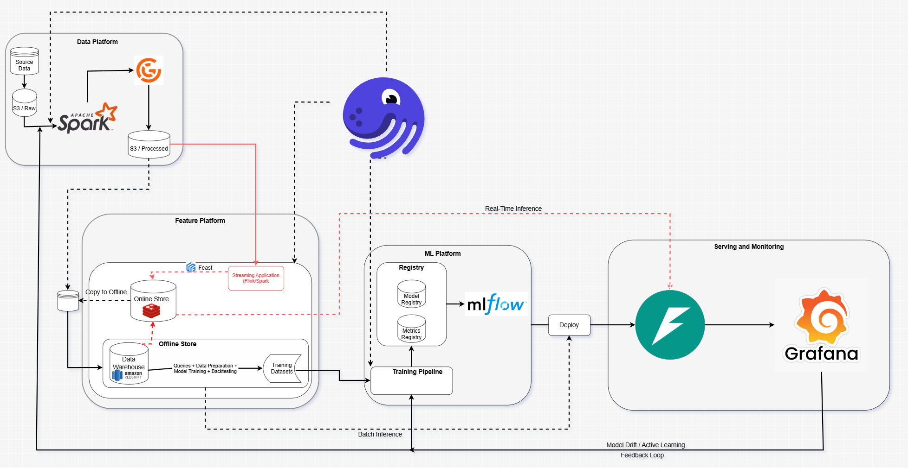

# RideFlow

**End-to-end MLOps platform for ride-hailing completion prediction.**

RideFlow predicts whether a ride order will be completed or cancelled, enabling proactive driver allocation, dynamic pricing adjustments, and improved user experience. The system covers the full ML lifecycle — from data ingestion and feature engineering to model training, real-time serving, and production monitoring.

## Architecture



The platform is composed of four major layers:

| Layer | Components | Purpose |
|---|---|---|
| **Data Platform** | Spark, S3, Great Expectations | Ingest raw data, validate quality, store processed datasets |
| **Feature Platform** | Feast, Redis, Redshift | Feature engineering, online/offline feature store |
| **ML Platform** | LightGBM, XGBoost, CatBoost, Random Forest, MLflow | Model training, experiment tracking, model registry |
| **Serving & Monitoring** | FastAPI, Prometheus, Grafana, Evidently | Real-time/batch inference, drift detection, performance dashboards |

**Orchestration** is handled by [Dagster](https://dagster.io), which schedules daily pipelines for ingestion, feature computation, and batch prediction.

---

## Project Structure

```
rideflow/
├── architecture/              # Architecture diagrams
│
├── data/
│   ├── raw/                   # Raw data ingestion (S3 → Spark)
│   │   ├── ingest_s3.py
│   │   └── schemas/           # Data schemas & validation
│   ├── processed/             # Cleaned datasets
│   ├── feature/               # Feature engineering & Feast
│   │   ├── feature_store.yaml # Feast project config (Redshift + Redis)
│   │   ├── feature_views.py   # Feast feature view definitions
│   │   ├── feature_service.py # Feast feature service
│   │   ├── transformations.py # Feature transformation functions
│   │   └── preprocessing.py   # Data preprocessing
│   └── storage/
│       └── split_data.py      # Train/val/test splitting
│
├── models/
│   ├── configs/
│   │   └── model_params.yaml  # Hyperparameters for all 4 models
│   ├── training/
│   │   ├── models.py          # Model factory (build_model) + defaults
│   │   ├── train.py           # Training pipeline with OOF evaluation
│   │   ├── evaluate.py        # Evaluation metrics (AUC, PR-AUC, ECE, etc.)
│   │   └── register_model.py  # MLflow model registration with fallback
│   └── notebooks/             # Exploration & analysis notebooks
│
├── inference/
│   ├── batch_predict.py       # Batch prediction (S3 → S3)
│   └── inference_pipeline.py  # Dagster job for batch inference
│
├── deployment/
│   ├── serve.py               # FastAPI real-time prediction API
│   ├── Dockerfile             # Multi-stage Docker build
│   ├── dashboard.py           # Monitoring dashboard
│   └── serving/
│       └── seldon_deployment.yaml  # Seldon Core deployment manifest
│
├── pipelines/                 # Dagster pipeline definitions
│   ├── ingestion/             # Data ingestion pipeline + sensors
│   ├── feature/               # Feature computation + Feast materialization
│   ├── drift/                 # Drift detection + auto-retrain triggers
│   ├── streaming/             # Kafka streaming pipeline
│   ├── spark/                 # Spark job definitions
│   └── expectations/          # Great Expectations data quality checks
│
├── dagster_workspace/
│   ├── workspace.yaml         # Dagster workspace config
│   ├── repository.py          # Dagster repository definition
│   └── schedules.py           # Daily cron schedules (ingest → feature → predict)
│
├── monitoring/
│   ├── evidently/
│   │   └── drift_report.py    # Data drift detection (PSI-based)
│   └── grafana/
│       ├── metrics_pusher.py       # Push metrics to Prometheus Pushgateway
│       ├── performance_tracker.py  # Track model performance over time
│       ├── prediction_logger.py    # Log prediction distributions
│       └── rideflow.json           # Grafana dashboard definition
│
├── infra/
│   ├── docker-compose.yml     # Full stack: Kafka, MLflow, Prometheus, Grafana, API
│   ├── prometheus.yml         # Prometheus scrape config
│   └── terraform/             # Infrastructure as Code (AWS)
│
├── tests/                     # Unit & integration tests
├── requirements.txt           # Python dependencies
└── pyproject.toml             # Project metadata
```

---

## Models

RideFlow supports **4 classification models**, all configured via a single YAML file:

| Model | Library | Key Hyperparameters |
|---|---|---|
| **LightGBM** | `lightgbm` | `num_leaves=63`, `max_depth=10`, `n_estimators=1000` |
| **XGBoost** | `xgboost` | `max_depth=8`, `n_estimators=1000`, `reg_lambda=1.0` |
| **CatBoost** | `catboost` | `depth=8`, `iterations=1000`, `l2_leaf_reg=3.0` |
| **Random Forest** | `scikit-learn` | `n_estimators=672`, `max_depth=8`, `max_features=0.3` |

All hyperparameters are defined in [`models/configs/model_params.yaml`](models/configs/model_params.yaml) and loaded at training time. The `build_model()` factory in [`models/training/models.py`](models/training/models.py) merges YAML config over built-in defaults.

**Calibration** is applied post-training using isotonic regression or Platt scaling to ensure well-calibrated probability outputs.

---

## Features

Feature engineering is handled in [`data/feature/transformations.py`](data/feature/transformations.py) and produces **27+ features** across these categories:

| Category | Examples |
|---|---|
| **Supply & Demand** | `supply_demand_ratio`, `demand_supply_ratio` |
| **Confidence** | `eta_confidence`, `eda_confidence` |
| **Trip Value** | `fee_per_km`, `eta_per_km`, `eta_eda_ratio`, `pickup_to_trip_ratio` |
| **Binary Flags** | `is_short_trip`, `is_long_eta`, `is_high_wait`, `is_single_driver` |
| **Interactions** | `short_trip_rush`, `low_supply_short_trip`, `high_eta_rush` |
| **Temporal** | `hour_sin`, `hour_cos`, `minutes_since_midnight`, `is_weekend` |
| **Driver Aggregation** | `driver_completion_rate_smoothed`, `driver_order_count` |

Features are stored and served via **Feast** with:
- **Offline Store**: Amazon Redshift (for training)
- **Online Store**: Redis (for real-time inference)

---

## Daily Pipeline Schedule

Orchestrated by Dagster with the following cron schedule:

| Time (UTC) | Pipeline | Description |
|---|---|---|
| **01:00** | `daily_ingest_schedule` | Ingest raw data → Spark processing → S3 |
| **02:00** | `daily_feature_schedule` | Feature computation → Feast materialization |
| **03:00** | `daily_inference_schedule` | Batch prediction → S3 output |
| *On drift* | `drift_alert_sensor` | Auto-trigger retraining when data drift is detected |

---

## Getting Started

### Prerequisites

- Python 3.11+
- Docker & Docker Compose
- AWS credentials (S3, Redshift)

### Installation

```bash
# Clone the repository
git clone https://github.com/bignohtinf/rideflow.git
cd rideflow

# Create virtual environment
py -3.11 -m venv .venv
.venv\Scripts\Activate      # Windows

# Install dependencies
pip install -r requirements.txt
```

### Environment Setup

Copy the environment template and fill in your credentials:

```bash
cp .env.example .env
```

Required variables:

```env
AWS_ACCESS_KEY_ID=your-access-key
AWS_SECRET_ACCESS_KEY=your-secret-key
AWS_DEFAULT_REGION=us-east-1
MLFLOW_TRACKING_URI=http://localhost:5000
PUSHGATEWAY_URL=localhost:9091
```

### Start Infrastructure

```bash
cd infra
docker-compose up -d
```

This starts: **Kafka**, **MLflow** (port 5000), **Prometheus** (port 9090), **Pushgateway** (port 9091), **Grafana** (port 3000), and the **Serve API** (port 8000).

---

## Usage

### Train a Model

```bash
python -m models.training.train <target_date> <model_name>

# Examples
python -m models.training.train 2026-06-17 lgbm
python -m models.training.train 2026-06-17 xgboost
python -m models.training.train 2026-06-17 catboost
python -m models.training.train 2026-06-17 random_forest
```

### Register a Model

```bash
python -m models.training.register_model <mlflow_run_id>
```

If registration fails, the system automatically falls back to the current staging model version.

### Run Batch Prediction

```bash
python inference/batch_predict.py <target_date>
```

### Real-Time Prediction API

```bash
curl -X POST http://localhost:8000/predict \
  -H "Content-Type: application/json" \
  -d '{"order_id": "ORD-12345"}'
```

Response:

```json
{
  "order_id": "ORD-12345",
  "completion_prob": 0.8723,
  "latency_ms": 12.3
}
```

### Health Check

```bash
curl http://localhost:8000/health
```

---

## Monitoring

| Tool | URL | Purpose |
|---|---|---|
| **MLflow** | `http://localhost:5000` | Experiment tracking, model registry |
| **Grafana** | `http://localhost:3000` | Performance dashboards (admin/admin) |
| **Prometheus** | `http://localhost:9090` | Metrics storage & querying |

### Drift Detection

Evidently generates data drift reports using PSI (Population Stability Index) with a threshold of 0.2. Reports are saved to S3 and can trigger automatic retraining via the `drift_alert_sensor` Dagster sensor.

### Performance Tracking

Model performance is tracked continuously against configurable thresholds:

| Metric | Threshold |
|---|---|
| AUC-ROC | ≥ 0.80 |
| Log Loss | ≤ 0.25 |
| ECE | ≤ 0.05 |

---

## Evaluation Metrics

Models are evaluated using 5-fold stratified cross-validation with the following metrics:

- **AUC-ROC** — Discrimination ability
- **PR-AUC** — Performance on imbalanced classes
- **Log Loss** — Probabilistic calibration
- **F1 Score** — Balance of precision and recall
- **ECE** — Expected Calibration Error
- **Precision@K** — Top-K prediction quality

---

## Tech Stack

| Category | Technologies |
|---|---|
| **ML Frameworks** | LightGBM, XGBoost, CatBoost, scikit-learn |
| **Feature Store** | Feast (Redshift offline + Redis online) |
| **Experiment Tracking** | MLflow |
| **Orchestration** | Dagster |
| **Data Processing** | Apache Spark, Pandas |
| **Streaming** | Apache Kafka |
| **Serving** | FastAPI, Uvicorn, Seldon Core |
| **Data Quality** | Great Expectations |
| **Monitoring** | Prometheus, Grafana, Evidently |
| **Infrastructure** | Docker, Terraform, AWS (S3, Redshift, ElastiCache) |
